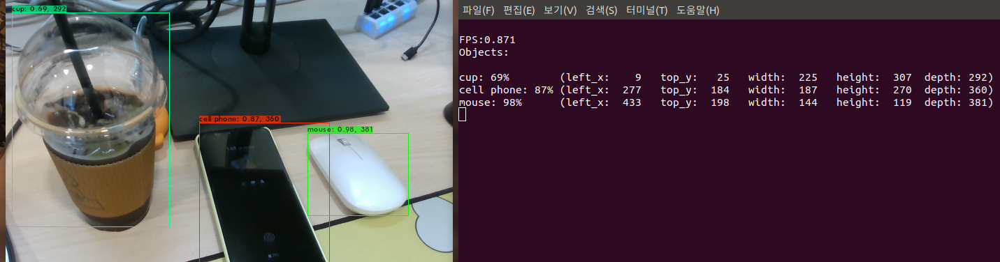
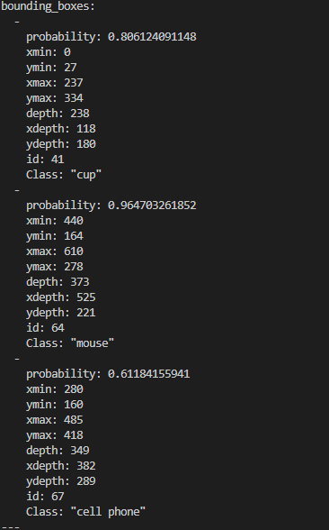

# Get distance fron darknet_ros and Realsense depth camera 
This repository is the environment of YOLO V4 ported to darknet_ros. <br>
Original repository [Tossy0423](https://github.com/Tossy0423/yolov4-for-darknet_ros)


# Installation
This repository assumes that the [Robot Operating System (ROS)](https://www.ros.org/) has already been installed on your environment.
See [ros.org](https://www.ros.org/install/) to know how to install ROS. My environment is [here](#Enviroment).


## Create workspace
First, create the ROS workspace. The `<workspace>` can be named arbitrarily.
```bash
## Create workspace for ROS, Change directory
$ mkdir -p catkin_ws/src && cd catkin_ws/src

## init workspace
$ catkin_init_workspace

## Make
$ cd ../
$ catkin_make
```

## Installation your environment
### Easy Installation
To clone `darknet` and `darknet_ros` as a submodule, you must clone them with `--recursive`. This allows you to clone the two submodules together.

```bash
$ cd src
$ git clone --recursive https://github.com/SeongJunKang/yolov4-for-darknet_ros.git
```

Directory tree structure
```
├── darknet
│   ├── 3rdparty
│   │   ├── pthreads
│   │   │   ├── bin
│   │   │   ├── include
│   │   │   └── lib
│   │   └── stb
│   │       └── include
│   ├── build
│   │   └── darknet
│   │       └── x64
│   │           ├── backup
│   │           ├── cfg
│   │           ├── data
│   │           │   ├── labels
│   │           │   └── voc
│   │           └── results
│   ├── cfg
│   │   └── yolov1
│   ├── cmake
│   │   └── Modules
│   ├── data
│   │   └── labels
│   ├── include
│   ├── results
│   ├── scripts
│   │   ├── log_parser
│   │   └── windows
│   └── src
├── darknet_ros
│   ├── config
│   ├── doc
│   ├── include
│   │   └── darknet_ros
│   ├── launch
│   ├── scripts
│   ├── src
│   ├── test
│   └── yolo_network_config
│       ├── cfg
│       └── weights
└── darknet_ros_msgs
    ├── action
    └── msg
```

## Download weights file
The weights file is very large and needs to be downloaded separately.
Download the weights file to `darknet_ros/darknet_ros/yolo_network_config/weights` to install it.
```bash
$ wget https://github.com/AlexeyAB/darknet/releases/download/darknet_yolo_v3_optimal/yolov4.weights
```

Also you want install `yolov4-tiny` see `darknet_ros/darknet_ros/yolo_network_config/weights/how_to_download_weights.txt` files


## make pkg
```bash
# Change workspace directory
$ cd ~/catkin_ws

## Make
$ catkin_make

# Write source command in ~/.bashrc
$ echo "source ~/catkin_ws/devel/setup.bash" >> ~/.bashrc
```


# Environment

|         Topics         	|                     Spec                     	|
|:----------------------:	|:--------------------------------------------:	|
|          Model         	|              Dell ALIENWARE m15              	|
|           CPU          	|   Intel® Core™ i5-7200U CPU @ 2.50GHz × 6   	|
|           RAM          	|                    15.4 GB                   	|
|           OS           	|           Ubuntu 18.04.3 LTS bionic          	|
|       Midlleware       	|                  ROS Melodic                 	|
|         Camera     	     |                  Realsense D435i			|


# Demo
I will describe how to demonstrate it in an implemented environment. Before you can do the demo, you need to prepare for it.

## Preparation
- Realsense D435i depth camera<br>
- ROS package of `realsense-ros`<br>
    If it has already been installed, there is no need to do it again. To install, execute the following command
  ```bash
  $ cd ~/catkin_ws
  $ git clone https://github.com/IntelRealSense/realsense-ros.git
  $ catkin_make
  $ echo "source ~/catkin_ws/devel/setup.bash" >> ~/.bashrc
  ```
- Fixing the launch file <br>
  If you use the `realsense-ros` package, you need to change the Topic of the camera image to input to darknet_ros. 
  Open the file `darknet_ros/config/ros.yaml` and change the file as follows
  ```
  ## Before
  topic: /camera/rgb/image_raw

  ## After
  topic: /camera/color/image_raw
  ```
## Running
Execute the three commands in another Terminal.
```bash
$ roscore
$ rosrun realsense2_camera rs_camera.launch align_depth:=true
$ roslaunch darknet_ros darknet_ros.launch
```
<div align=center>

</div>

And use `darknet_ros/darknet_ros/scripts/ObjectDistance.py`
```bash 
$ python ObjectDistance.py 
```

Now we can see the topic for distance `/darknet_ros/distance`
```bash
$ rostopic list
```
<div align=center>

</div>

```bash
$ rostopic topic /darknet_ros/distance
```
<div align=center>

</div>


# How to build this environment??
Here is the documentation to set up this environment.


# Acknowledgment
This repository consists of two large repositories, [AlexeyAB](https://github.com/AlexeyAB)'s [darknet](https://github.com/AlexeyAB/darknet) and [legged robotics](https://github.com/leggedrobotics)'s [darknet_ros](https://github.com/leggedrobotics/darknet_ros).
For building this environment, I have a reference to the information published by many developers.
I would like to thank the developers who made these repositories available to me, and many of them have contributed their information to make this environment possible.


# LISENCE
This software is released under the MIT License, see LICENSE.

# Autor
Original repository : Tossy Japan, Osaka<br>
This repository : SeongJun Kang Korea, Seoul<br>


